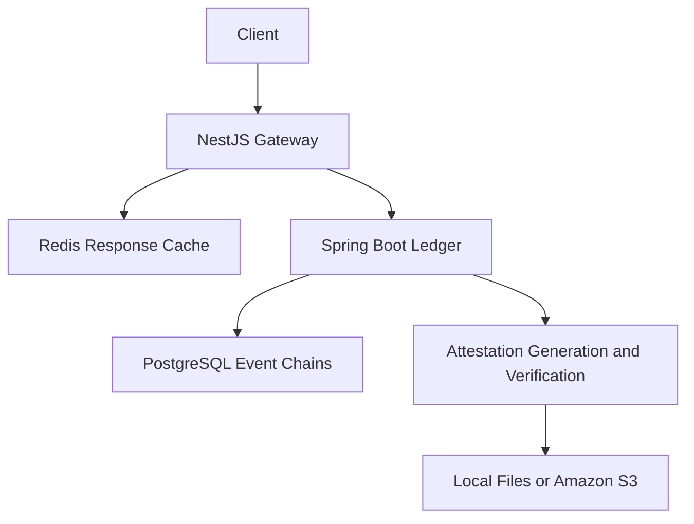

# Proof-Pulse

An evidence ledger for recording software events, checking their integrity, and generating signed attestations.

Built with Java, Spring Boot, TypeScript, NestJS, PostgreSQL, and Redis.

## Overview

Proof-Pulse organizes evidence events by project and artifact. Each event is linked to the previous event through a SHA-256 hash, creating a history that can be checked for changes.

The application separates event ingestion from ledger storage. A NestJS gateway validates incoming requests and caches successful responses in Redis. A Spring Boot service stores events in PostgreSQL, verifies hash chains, and generates Ed25519-signed attestation bundles.

Bundles can be stored locally or in Amazon S3.

## Features

- Request validation for structured evidence events.
- Redis-backed response caching using an `Idempotency-Key`.
- PostgreSQL storage with Flyway database migrations.
- Separate hash chains for each project and artifact.
- Canonical JSON serialization for consistent hashing.
- Chain integrity verification.
- Ed25519 attestation generation and verification.
- Local and S3 storage for attestation bundles.
- Presigned S3 download URLs.
- Swagger documentation for the ingestion gateway.

## Tech Stack

| Component | Technology |
|---|---|
| Ingestion Gateway | TypeScript, NestJS 10 |
| Ledger Service | Java 17, Spring Boot 3.3.2 |
| Database | PostgreSQL 16 |
| Response Cache | Redis 7 |
| Database Migrations | Flyway |
| Integrity and Signing | SHA-256, Ed25519 |
| Bundle Storage | Local filesystem, Amazon S3 |
| Local Infrastructure | Docker Compose |
| API Documentation | Swagger, OpenAPI |

## Architecture

The gateway handles validation and request retries. The ledger service handles persistence, hashing, and attestations.



### Event Ingestion

1. The client submits an event with an `Idempotency-Key` header.
2. The gateway validates the request body.
3. If Redis contains a response for that key, the gateway returns it.
4. Otherwise, the gateway forwards the event to the ledger.
5. The ledger canonicalizes the event and calculates its hash using the previous hash.
6. The event is stored in PostgreSQL.
7. The gateway caches the successful response for five minutes.

### Attestation Generation

1. Verify the selected project and artifact chain.
2. Record the chain head hash and index in an attestation payload.
3. Sign the canonical payload using Ed25519.
4. Store the bundle locally or in S3.
5. Return a bundle ID and download location.

Verification checks the signature, canonical payload, chain integrity, and whether the attestation matches the current chain head.

## Repository Structure

| Path | Purpose |
|---|---|
| `ingest-gateway/` | NestJS API, validation, response caching, and ledger client |
| `ledger-service/` | Spring Boot application and Maven configuration |
| `ledger-service/src/main/java/com/proofpulse/ledger/` | Ledger, hashing, verification, signing, and storage code |
| `ledger-service/src/main/resources/db/migration/` | Flyway database migrations |
| `ledger-service/attestation-bundles/` | Example attestation bundles |
| `ledger-service/site/` | Static site files |
| `contracts/openapi.yaml` | API contract |
| `infra/docker-compose.yml` | Local PostgreSQL and Redis services |
| `attestation.json` | Example attestation |

The repository also includes AWS deployment configuration files for ECS, S3, CloudFront, and IAM. These contain environment-specific settings and require adaptation before use.

## Local Setup

### Requirements

- Java 17
- Maven
- Node.js and npm compatible with NestJS 10
- Docker with Docker Compose
- Git

### 1. Clone the Repository

```bash
git clone https://github.com/riteshvd/Proof-Pulse.git
cd Proof-Pulse
```

### 2. Start PostgreSQL and Redis

From the repository root:

```bash
docker compose -f infra/docker-compose.yml up -d
```

Check the containers:

```bash
docker compose -f infra/docker-compose.yml ps
```

The local database configuration uses:

| Setting | Value |
|---|---|
| Database | `proofpulse` |
| Username | `proofpulse` |
| Password | `proofpulse` |
| PostgreSQL Port | `5432` |
| Redis Port | `6379` |

These credentials are for local development.

### 3. Start the Ledger Service

In a separate terminal:

```bash
cd ledger-service
mvn spring-boot:run
```

The ledger listens on port `8081`. Flyway is configured to apply database migrations at startup.

### 4. Start the Ingestion Gateway

In another terminal, from the repository root:

```bash
cd ingest-gateway
npm ci
npm run start:dev
```

The gateway listens on port `3001`.

### Local URLs

| Service | URL |
|---|---|
| Gateway Health | http://localhost:3001/health |
| Ledger Health | http://localhost:8081/health |
| Gateway API Documentation | http://localhost:3001/docs |

## Configuration

### Ingestion Gateway

| Variable | Purpose | Default |
|---|---|---|
| `LEDGER_URL` | Ledger service address | `http://localhost:8081` |
| `REDIS_URL` | Redis connection string | `redis://localhost:6379` |

### Ledger Service

| Variable | Purpose |
|---|---|
| `SPRING_DATASOURCE_URL` | PostgreSQL JDBC URL |
| `SPRING_DATASOURCE_USERNAME` | Database username |
| `SPRING_DATASOURCE_PASSWORD` | Database password |
| `PP_ATTEST_PRIVATE_KEY_B64` | Base64-encoded PKCS#8 Ed25519 private key |
| `PP_ATTEST_PUBLIC_KEY_B64` | Base64-encoded X.509 Ed25519 public key |
| `PP_S3_BUCKET` | Enables S3 bundle storage when set |
| `PP_S3_PREFIX` | Object prefix; defaults to `attestations/` |
| `PP_S3_PRESIGN_MINUTES` | Download URL lifetime; defaults to `15` |
| `AWS_REGION` | AWS region; falls back to `AWS_DEFAULT_REGION`, then `us-east-1` |
| `PP_S3_ENDPOINT` | Optional alternative S3 endpoint |

Without a configured signing key pair, the service generates a development key pair at startup. Configure both key variables to preserve the signing identity across restarts.

S3 storage uses the AWS SDK default credential provider chain.

## API Reference

| Method | Endpoint | Service | Purpose |
|---|---|---|---|
| `GET` | `/health` | Gateway / Ledger | Health endpoint |
| `POST` | `/events` | Gateway | Submit an evidence event |
| `POST` | `/internal/ledger/events` | Ledger | Internal event ingestion |
| `GET` | `/chains/verify` | Ledger | Verify a project/artifact chain |
| `POST` | `/chains/repair` | Ledger | Recalculate chain data |
| `POST` | `/attestations/generate` | Ledger | Generate a signed attestation |
| `GET` | `/attestations/{bundleId}` | Ledger | Download a stored bundle |
| `POST` | `/attestations/verify` | Ledger | Verify an attestation bundle |

Chain and attestation generation endpoints accept `projectId` and `artifactId` query parameters.

## Example Requests

The following examples use Bash syntax. On Windows, use Git Bash or adapt the commands for PowerShell.

### Submit an Event

```bash
curl -X POST http://localhost:3001/events \
  -H "Content-Type: application/json" \
  -H "Idempotency-Key: proofpulse-demo-001" \
  -d '{
    "schemaVersion": 1,
    "eventId": "a4e8a3b0-58f0-4c9a-9f34-87c95a72d219",
    "projectId": "proofpulse-demo",
    "artifactId": "service:ledger",
    "source": "local-demo",
    "timestamp": "2026-09-25T12:00:00Z",
    "type": "BUILD_COMPLETED",
    "payload": {
      "version": "1.0.0",
      "status": "passed"
    }
  }'
```

A successful gateway response has this structure:

```json
{
  "eventId": "a4e8a3b0-58f0-4c9a-9f34-87c95a72d219",
  "status": "ACCEPTED"
}
```

Use a new event ID and idempotency key for each new event. See the implementation notes below for a current first-event response issue.

### Verify the Chain

```bash
curl "http://localhost:8081/chains/verify?projectId=proofpulse-demo&artifactId=service:ledger"
```

### Generate an Attestation

```bash
curl -X POST \
  "http://localhost:8081/attestations/generate?projectId=proofpulse-demo&artifactId=service:ledger"
```

For local storage, the response includes a `bundleId` and `downloadEndpoint`. For S3 storage, it includes a presigned `downloadUrl`.

### Download a Local Bundle

Replace `BUNDLE_ID` with the returned ID:

```bash
curl "http://localhost:8081/attestations/BUNDLE_ID" \
  -o downloaded-attestation.json
```

### Verify the Bundle

```bash
curl -X POST http://localhost:8081/attestations/verify \
  -H "Content-Type: application/json" \
  --data-binary @downloaded-attestation.json
```

## Implementation Notes

- **First-event response:** The ledger builds its response using `Map.of()` with a null `prevHash` for the first event. Java rejects null map values, so this path can return an error after the insert statement. This needs correction before relying on the ingestion walkthrough.
- **Retry handling:** Redis caches successful responses for five minutes. The cache lookup and ledger write are not atomic, so this does not provide exactly-once processing.
- **Issuer trust:** Verification uses the public key supplied in the bundle. Establishing a trusted issuer requires a separate trusted-key policy.
- **Chain updates:** Verification compares the attestation against the current chain head. Adding events can make an older attestation fail the head comparison even when its signature remains valid.
- **Access control:** Authentication and authorization are not implemented in the inspected controllers. Ledger and repair endpoints should remain restricted during development.
- **Integrity scope:** Hash chaining supports detection of inconsistent changes. It does not prevent a privileged database user from rewriting a chain.

## Future Improvements

- Correct ingestion response handling and duplicate-event status codes.
- Add integration tests for ingestion, retries, and verification.
- Add authentication and project-level authorization.
- Make concurrent retry handling atomic.
- Introduce trusted signing-key registration and rotation.
- Support verification against historical chain heads.
- Add automated build and deployment workflows.

## Contact

**Ritesh Varma Dommaraju**  
[GitHub](https://github.com/riteshvd)
